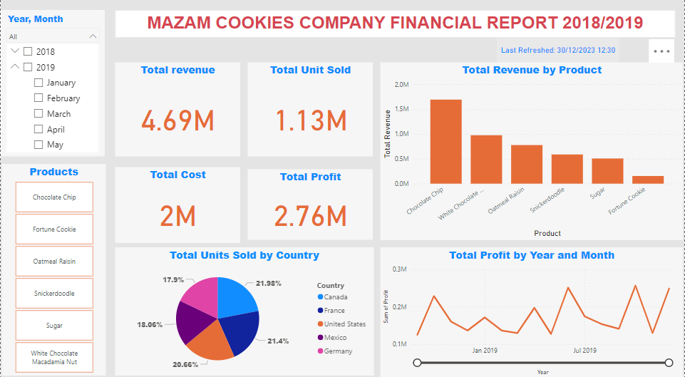
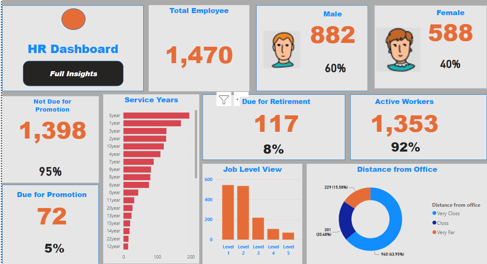

**Abiola Adeyemo Data Analysis Portfolio**

[Project 1: An analysis of ADIDAS Financial Report 2020/2021](https://github.com/Biolaraji?tab=repositories)

A statistical analysis was carried out on ADIDAS sales performance accross the brand products and sales regions for the Financial Year 2020/2021.

The analysis explored the data to identify patterns, trends, and anomalies to gain insight into the distribution of quantity sold accross different products, regions and sale channels.

Excel (Pivot chart) visualisation was used to analyse the key metrics; unit sold, total sales, total profit in explaining popularity, demands and contribution of each products to the overall revenue.

[Project 2: Analysis of MAZAM Cookies Company  Financial Report 2018/2019](https://github.com/Biolaraji?tab=repositories)

Analysis of a cookies company was carried out using PowerBI visualisation.

DAX was used to create different measures to give insight into sales performance of the company's products accross different countries.

The analysis engaged key metrics to analyse the contributions of the company's product towards its revenue and net profit,and easy periodical comparison for insightful business decisions.

[Project 3: HR Dashboard](https://github.com/Biolaraji?tab=repositories)

The project is the PowerBI visual representation of organisations's employee distribution.

Measures were created, using DAX expression, for analysis of proportional representation of gender, job levels and employees status for insight into resouces distribution analysis for informed business decision.

